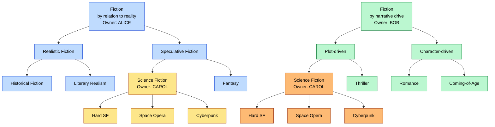
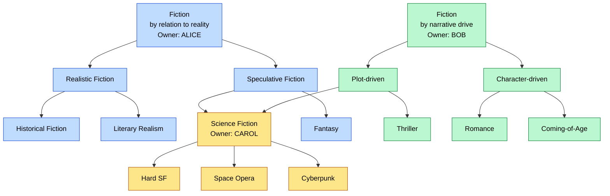

# Spec-Driven Development Tool Comparison Plan

This document describes a plan for comparing spec-driven development tools with each other and with vibe coding not using specs. I wrote a complex [Produce Requirements Document](prd/prd.md) (PRD), divided it into phases, and asked each tool to implement the phases, producing artifacts I could use to compare how well the tools did. I responded to any issues and questions the LLM raised that it didn't seem to have a solution for, allowing the LLM to benefit from its due diligence. I posted a separate document explaining the results.

## Objective

The objective of this experiment is to evaluate how well spec-driven development tools perform compared to each other and to development without using tool-managed specifications. I specifically wanted to see whether spec-driven development helps uncover more gaps and inconsistencies, so I chose to have the tools implement a complex project having a few gaps and inconsistencies.

## Caveats

- I had the tools create anticipated test cases in advance of implementation, which certainly affected outcomes. The tools also maintained summaries of the final test cases and the diffs from the initial.
- OpenSpec is not intended for more than 10 tasks at a time, but several phases had more than 10.
- I started with a specification detailing observable behavior but not implementation. Spec-driven development may be more geared toward working with the LLM to define the initial specification, especially one as technical as I defined.
- The tools gave opportunities for me to explore aspects of implementation during planning, but I only explored the aspects that the LLM appeared to be indicating were potentially problematic. I think both LLMs would have done better had I done more joint exploration.

## Tools Tested

I intended to test OpenSpec, Allium, and vanilla Claude Code, but the effort was too time-consuming and I did not get around to testing Allium. I did however design the test of OpenSpec to be comparable to the intended test of Allium.

TBD: describe the tools

| Feature | Claude Code w/ Planning | OpenSpec | OpenSpec +  OpenLore drift | Allium (untested) |
| --- | --- | --- | --- | --- |
| Creates specs | no | YES | YES | YES |
| Maintains specs | n/a | no | no | ? |
| Detects spec drift | n/a | no | YES | YES |
| Specs only describe behavior | n/a | YES | YES | YES |
| Planning phase | YES | YES | YES | ? |

## The Target Project

I worked with The Claude Code website to produce a PRD for a webservice that would be challenging to implement correctly. The project is an aspect of a problem I've been thinking about a long time, but you'll need some background to understand it. I chose a complex problem to tax the tool so I could more readily compare how well different tools do.

### Project Background and Problem

Contrary to popular understanding, biological taxonomy -- domain, kingdom, phylum, class, order, family, genus, species -- is merely a human filing system, not reflecting the reality of nature. Even so, it is an important system, because it helps us to refer to organisms in conversation with others so that we (usually) know exactly what organisms are being referenced.

Scientists use this filing system with a reality that doesn't neatly fit the filing system. Different biologists have different priorities and different needs, inclining them to file organisms differently. However, the purpose of the filing system it to facilite clear communication, so we must ultimately end up choosing among the competing proposals.

The problem is that all of our taxonomic databases represent the end state of this filing system -- the state in which all decisions have been made. This presents several problems:

- People need to share competing alternatives for the same tree.
- People who fail to agree publish different taxonomic databases.
- People want to own their databases to maintain authority.

Each name in a taxonomy -- each node in a taxonomic tree -- is called a "taxon" (plural "taxa").

### Overview of the Solution

The target project defines a partial solution in the form of a webservice that provides endpoints for collaboratively maintaining taxonomic trees. The solution uses a model having these properties:

- The model can represent many taxonomic trees and subtrees.
- Users own and manage the taxa and subtrees of their choosing.
- Trees can share subtrees that may be owned by others.
- Users can propose changes to other people's subtrees.
- Owners evaluate and accept/reject proposals for their subtrees.

This solution solves the aforementioned problems as follows:

- One database presents competing taxonomies for collaborative evolution.
- One database partitions ownership/authority of taxa to different people.
- Invididual trees are composed of subtrees owned by different people.

### Example Competing Trees

To make this project more accessible, we'll work with taxonomies of genres of fiction and avoid using the Latinized scientific names used in biology. Notice that the following two taxonomies are different except for a common subtree. Notice also that different people own the different subtrees, with both Alice and Bob using Carol's Science Fiction subtree.

We can represent this as two trees sharing a common subtree, with portions of each subtree owned by different people:

In reality, the trees would be much more complex, sharing many subtrees having many different owners.

## PRD Development

I developed the [Produce Requirements Document](prd/prd.md) (PRD) using the Claude.ai website. I spent about 4 hours carefully explaining my vision and working with Claude to iron on inconsistencies, doing so over several conversations. My original vision was to produce a common API for all implementations, but I eventually realized that differences in design decisions would change the API, so I only abstractly specified the endpoints.

I was planning to create a second PRD for extending the solution into a peer-to-peer protocol. Asking the tools to implement this extension on top of the existing implementation would test the tool's ability to refactor, but I ran out of time.

## Implementation Phases

After developing the PRD, I asked Claude.ai to break its implementation into phases. These are the phases we decided on:

1. **Scaffold, error model, format validators** — stack skeleton, JSON error
   envelope and status mapping, the two pure format validators (taxon name,
   username), the test runner, and the `POST /reset` state-reset endpoint used
   for per-test isolation.
2. **Users, identity, registry** — registration, `X-Username` parsing, and the
   400/403 middleware that gates every later write.
3. **Domain model and the invariant engine** — in-memory store, IDs, edges, the
   reachability layer, the pure §3.3 invariant module, and the read surface.
4. **Direct owner actions** — create, edit, edge add/remove, write serialization,
   with **delete (§6.3)** as a tracked sub-milestone.
5. **Proposal submission** — payload model, routing, dependency classification,
   and initial disposition. Stops before any review decision.
6. **Single review loop** — accept-single, reject, latent→queued promotion, and
   ownership transfer on accepting a create.
7. **Cascade + invalidation + integration** — atomic accept-cascade with
   rollback, the three invalidation modes, dismiss, and end-to-end coverage.

## Anticipated Complications

1. **Validation reaches across every shared tree.** Because a single subtree (like Carol's Science Fiction) can appear inside several different trees, a change to that subtree can have consequences in trees the proposer never looked at. Renaming a taxon, for example, might be perfectly fine in the tree where the proposal was filed, but collide with a same-named sibling somewhere over in a stranger's tree. An implementation that only checks the tree where the change was proposed will appear correct in casual testing and silently break the invariants that hold the model together.

2. **Same taxon can appear in many trees, but only once per tree.** The point of the model is that subtrees are shared between trees, yet within any single tree a taxon must still be reachable by exactly one path. That makes "is this taxon already here?" a question whose answer depends entirely on which tree you ask it from. It is easy to land on one of two wrong simplifications: forbid sharing across trees (defeating the whole design), or allow duplication within a tree (corrupting individual trees).

3. **Deletion has to stop at other people's taxa.** Deleting a taxon is supposed to take its descendants with it, but only the ones the deleter owns; the cascade has to halt the moment it hits a taxon owned by someone else. Worse, descendants the deleter owns that sit *below* a foreign-owned halt point must be left alone, and the deletion is forbidden outright if any taxon in the affected region is being shared into another tree. The rules for what gets removed, what stays, and when the operation is allowed at all are interlocking and easy to get subtly wrong, with the failure mode being either silent data loss or rejected operations that should have succeeded.

4. **Who ends up owning a taxon after a proposal is accepted is not obvious.** When a proposal to create a new taxon is accepted, the reviewer — not the person who proposed it — becomes the owner of that new taxon. But when a proposal moves an *existing* subtree under a new parent, the original owner of that subtree keeps it. The two cases look superficially similar and an implementation can plausibly handle them the same way, which then misroutes every subsequent proposal that touches those taxa to the wrong reviewer.

5. **A change can be waiting on different kinds of things.** A proposed change can depend on other proposed changes in two genuinely different ways: it may be waiting for some other proposal to be *decided* first, or it may simply require that some other taxon still *exists* when the time comes. These two kinds of waiting need to be tracked separately and resolved on different signals — and if they're conflated, changes get released too early, get stuck forever, or get matched up with reviewers who shouldn't be seeing them.

6. **A proposal describes a partial picture, not a complete one.** A single proposal can package several related changes into a nested structure, but that structure is deliberately *incomplete*: it says what should change and leaves everything else unmentioned. An implementation has to resist the temptation to fill in the silences — children not listed are not being removed, parents not mentioned are not being abandoned. There is also a placeholder kind of entry whose only job is to anchor nested changes underneath it; mistaking those for real edits, or mistaking real silences for deletions, both quietly mutilate the model.

7. **Accepting a batch of changes has to succeed or fail as a single unit.** When a reviewer accepts a proposal that pulls along several dependent changes in one cascade, every constituent change has to be applied in order and validated against the state produced by the previous ones — and if any single step fails, the entire cascade has to be undone, including the steps that already succeeded. The validity of any individual change can also flip depending on what got applied before it in the same cascade, so a change that would have been fine in isolation can fail inside the cascade and vice versa. Implementations that apply changes greedily, or that validate against a stale snapshot, will either corrupt the model on failure or reject cascades that should have gone through.

8. **Validity of queued changes is judged only when someone looks.** A change that has been queued up for a reviewer might quietly become invalid because of something an unrelated party did, and the system deliberately does *not* notice this in the moment — it only re-evaluates validity when the reviewer next reads or acts on their queue. There are also several different reasons a change can become invalid, and they aren't treated the same way: some are dropped automatically, others sit in the queue marked invalid until the reviewer explicitly dismisses them. Collapsing those modes together — or eagerly recomputing validity to "be safe" — breaks both performance and the contract the reviewer is operating under.

## Introduced Defects

The PRD also contains four deliberately introduced defects, planted so we could observe whether each tool surfaces them during its planning and spec-analysis pass. Two are gaps, two are inconsistencies, and one of each pair is considered obvious, the other subtle. An *inconsistency* is two passages of the spec contradicting each other; a *gap* is a decision the spec needs to make but never does.

1. **(Inconsistency, obvious) The spec contradicts itself about whether a cascade of accepted changes commits as a whole or piece by piece.** One passage says that if any step of the cascade fails, the entire cascade rolls back to the state before the call. Another passage, describing the corresponding endpoint, says successful steps commit independently and a failure aborts only the unprocessed remainder. The two readings produce completely different behavior on the most important failure path, and the contradiction is about a flagship behavior the spec spends an entire paragraph defining — exactly the kind of head-on conflict any genuine consistency pass is built to catch.

2. **(Inconsistency, subtle) The spec gives two different answers to whether taxon-name comparisons are case-sensitive.** The model section and its invariants treat names as case-insensitive: "Fiction" and "fiction" are the same name. The rule for the in-tree name-clash check that runs when you add a child to a parent, however, specifies that names are compared as exact, case-sensitive strings. Both passages govern the same uniqueness check, but they sit several sections apart and the disagreement is at the attribute level — a casing flag — rather than at the headline level. A tool that restates the spec section-by-section instead of cross-referencing definitions against their later uses will walk straight past it.

3. **(Gap, obvious) The spec gives the reviewer several ways to dispose of a proposal but never gives the proposer a way to withdraw one.** Submission, accept, reject, dismiss, and several flavors of automatic invalidation are all defined; proposer-initiated cancellation is simply missing — no operation, no behavior, no mention of the word. An implementer has to invent the rules from nothing: can you cancel at all, and if so what happens to changes already queued for a reviewer or already accepted? "A way to create without a way to cancel" is a textbook lifecycle gap that any completeness-oriented pass should turn up the moment it asks what verbs each role gets.

4. **(Gap, subtle) The spec never decides what happens when a proposal contains an operation on a taxon the proposer themselves owns.** Proposals are described as targeting trees owned "wholly or partly by others," which quietly admits mixed ownership — and the routing rule that sends each change to its taxon's owner will then mechanically route some of those changes back to the proposer. Whether that case is allowed at all, whether it auto-applies (the proposer could just edit directly), or whether it queues for the proposer's own self-review like any other change, is never said. The routing rule has an answer in the mechanical sense, so a shallow read concludes the case is handled; the real gap is the unaddressed design decision, which only surfaces when a tool composes the two sections and notices the boundary case neither alone resolves.

## Implementation Process

Add `CLAUDE.md`

Claude Code

- Plan
- (Interaction)
- (Write initial test plan)
- Approve and accept edits
- (Write final test plan)

OpenSpec

- Explore
- (Interaction)
- Propose
- (Interaction ?)
- (Write initial test plan)
- Apply
- (Write final test plan)
- Archive

## Conclusions

- OpenSpec invites more participation in the design and implementation process
- OpenSpec `explore` is friendlier and more enjoyable than CC's `plan`
- OpenSpec is a great tool for understanding what the AI is doing
- OpenSpec is a better tool for helping junior devs learn
- OpenSpec takes a lot more time and is a lot more costly
- Vanilla CC is better for vibe code a quick solution
- Allium, having 9 agents vote on each code change, is probably very expensive, best suited for developing a particular component.

## Notes

- Lazy evaluation complicated things.
