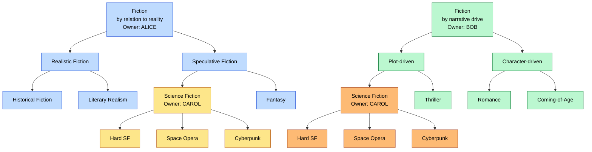
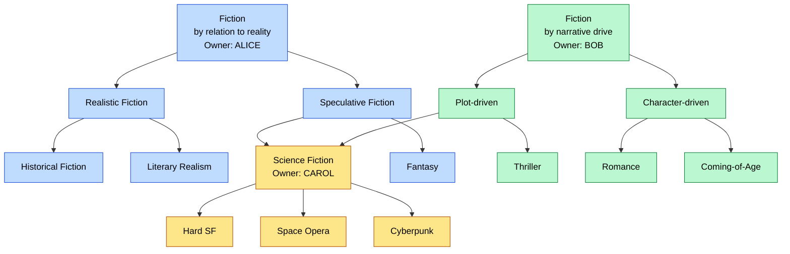

# Spec-Driven Development Tool Comparison Plan

This document describes a plan for comparing spec-driven development tools with each other and with vibe coding not using specs. I wrote a complex Produce Requirements Document (PRD), divided it into phases, and asked each tool to implement the phases, producing artifacts I could use to compare how well the tools did. I responded to any issues and questions the LLM raised that it didn't seem to have a solution for, allowing the LLM to benefit from its due diligence. I posted a separate document explaining the results.

## Objective

The objective of this experiment is to evaluate how well spec-driven development tools perform compared to each other and to development without using tool-managed specifications. I specifically wanted to see whether spec-driven development helps uncover more gaps and inconsistencies, so I chose to have the tools implement a complex project having a few gaps and inconsistencies.

## Caveats

- OpenSpec is not intended for more than 10 tasks at a time, but several phases had more than 10.
- I started with a specification detailing observable behavior but not implementation. Spec-driven development may be more geared toward working with the LLM to define the initial specification, especially one as technical as I defined.
- The tools gave opportunities for me to explore aspects of implementation during planning, but I only explored the aspects that the LLM appeared to be indicating were potentially problematic. I think both LLMs would have done better had I done more joint exploration.

## Tools Tested

I intended to test OpenSpec, Allium, and vanilla Claude Code, but the effort was too time-consuming and I did not get around to testing Allium. I did however design the test of OpenSpec to be comparable to the intended test of Allium.

| Feature | Claude Code w/ Planning | OpenSpec | OpenSpec +  OpenLore drift | Allium (untested) |
| --- | --- | --- | --- | --- |
| Creates specs | no | YES | YES | YES |
| Maintains specs | n/a | no | no | ? |
| Detects spec drift | n/a | no | YES | YES |
| Specs only describe behavior | n/a | YES | YES | YES |
| Planning phase | YES | YES | YES | ? |

## The Target Project

I worked with The Claude Code website to produce a PRD for a webservice that would be challenging to implement correctly. The project is an aspect of a problem I've been thinking about a long time, but you'll need some background to understand it. I chose a complex problem to tax the tool so I could more readily compare how well different tools do.

### Project Background and Problem

Contrary to popular understanding, biological taxonomy -- domain, kingdom, phylum, class, order, family, genus, species -- is merely a human filing system, not reflecting the reality of nature. Even so, it is an important system, because it helps us to refer to organisms in conversation with others so that we (usually) know exactly what organisms are being referenced.

Scientists use this filing system with a reality that doesn't neatly fit the filing system. Different biologists have different priorities and different needs, inclining them to file organisms differently. However, the purpose of the filing system it to facilite clear communication, so we must ultimately end up choosing among the competing proposals.

The problem is that all of our taxonomic databases represent the end state of this filing system -- the state in which all decisions have been made. This presents several problems:

- People need to share competing alternatives for the same tree.
- People who fail to agree publish different taxonomic databases.
- People want to own their databases to maintain authority.

Each name in a taxonomy -- each node in a taxonomic tree -- is called a "taxon" (plural "taxa").

### Overview of the Solution

The target project defines a partial solution in the form of a webservice that provides endpoints for collaboratively maintaining taxonomic trees. The solution uses a model having these properties:

- The model can represent many taxonomic trees and subtrees.
- Users own and manage the taxa and subtrees of their choosing.
- Trees can share subtrees that may be owned by others.
- Users can propose changes to other people's subtrees.
- Owners evaluate and accept/reject proposals for their subtrees.

This solution solves the aforementioned problems as follows:

- One database presents competing taxonomies for collaborative evolution.
- One database partitions ownership/authority of taxa to different people.
- Invididual trees are composed of subtrees owned by different people.

### Example Competing Trees

To make this project more accessible, we'll work with taxonomies of genres of fiction and avoid using the Latinized scientific names used in biology. Notice that the following two taxonomies are different except for a common subtree. Notice also that different people own the different subtrees, with both Alice and Bob using Carol's Science Fiction subtree.

We can represent this as two trees sharing a common subtree, with portions of each subtree owned by different people:

In reality, the trees would be much more complex, sharing many subtrees having many different owners.

## Notes

- Lazy evaluation complicated things.
